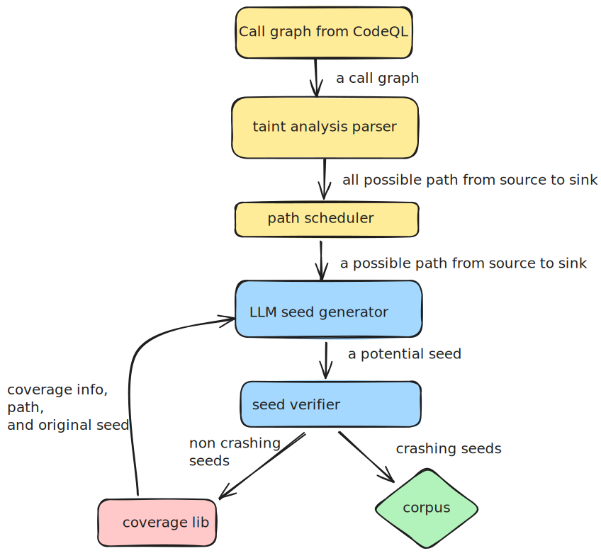

## QuickSeed Flow Chart



To run the taint parser tests, first make sure you have graphviz and xdg by running:
```
sudo apt-get install graphviz
sudo apt-get install xdg-utils
```

For mac users, you will need to use docker, because some source code requires Linux environment to be downloaded, and we are not bothered to separate them out from Linux.

Then run:
```
pytest tests/tests.py::TestQuickSeed::test_jenkins_taint_parser -s -v
```
