# Legend

$${\color{green}{\text{Highest SyMCTS entry}}}$$
$${\color{orange}{\text{Highest Non-SyMCTS Entry}}}$$

🥇🥈🥉 - 1st, 2nd and 3rd best in column

# Positive examples

## bloaty

|             2d            |             4d           |
| ------------------------- | ------------------------ |
| 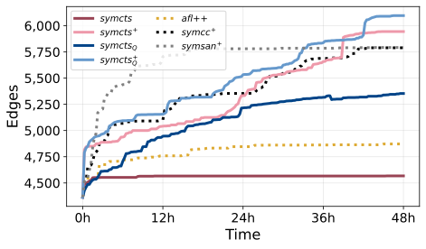 | 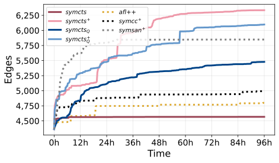 |

### 4days
| fuzzer             | last_reported_time | count  | min     | max     | mean          | median     |
| ------------------ | ------------------ | ------ | -----   | -----   | ------------- | ---------- |
| symcts_afl         | 96h0m              | 20     | 6152🥇  | 6389🥇  | 6313.80🥇     | 6335.0🥇   |
| symcts_symqemu_afl | 96h0m              | 20     | 5694🥉  | 6291🥈  | 6007.80🥈     | 6098.0🥈   |
| symsan             | 96h0m              | 20     | 5766🥈  | 5955🥉  | 5843.80🥉     | 5849.0🥉   |
| symcts_symqemu     | 96h0m              | 8      | 5412    | 5546    | 5479.00       | 5479.0     |
| symcc_aflplusplus  | 96h0m              | 20     | 4889    | 5857    | 5266.40       | 4992.0     |
| aflplusplus        | 96h0m              | 20     | 4768    | 5120    | 4870.20       | 4799.0     |
| symcts             | 96h0m              | 16     | 4567    | 4570    | 4567.75       | 4567.0     |


Obvious win for us across the board.
Even symcts_symqemu alone beat symcc and afl++ (by ~10% more edges).
Lastly, our progress is still going, symsan got an advantage early but plateau'd hard after ~32hours.

Symcts_afl's worst instance beats all other approaches' best instance by a wide margin:

symcts_afl worst vs. best instance of
| symcts_afl worst | symcts_afl best | fuzzer | Cov best   | Abs. diff worst | %diff worst   | abs. diff best | %diff best |
| ---------------- | --------------- | ------ | --------   | --------------- | ------------- | -------------- | ---------- |
|             6152 |            6389 | symsan |     5955 |             197 |         +3.3% |            434 |      +7.3% |
|             6152 |            6389 |  symcc |     5857   |             295 |         +5.0% |            532 |      +9.1% |
|             6152 |            6389 |  afl++ |     5120   |            1032 |        +20.2% |           1269 |     +24.7% |

## 2 days
| fuzzer             | last_reported_time | count  | min     | max     | mean            | median       |
| ------------------ | ------------------ | ------ | -----   | -----   | -------------   | ----------   |
| symcts_symqemu_afl | 48h0m              | 10     | 5726🥈  | 6179🥇  | 5988.4🥇        | 6096.0🥇     |
| symcts_afl         | 48h0m              | 10     | 5039    | 6023🥈  | 5619.4🥉        | 5944.0🥈     |
| symsan             | 48h0m              | 10     | 5780🥇  | 5829    | 5803.2🥈        | 5792.0🥉     |
| symcc_aflplusplus  | 48h0m              | 10     | 4724    | 5900🥉  | 5397.4          | 5789.0       |
| symcts_symqemu     | 48h0m              | 2      | 5353🥉  | 5353    | 5353.0          | 5353.0       |
| aflplusplus        | 48h0m              | 10     | 4677    | 4900    | 4833.2          | 4872.0       |
| symcts             | 48h0m              | 10     | 4560    | 5087    | 4760.8          | 4567.0       |

Same trend for us, but shows symcc also actually catching up with symsan

## libxml2

###

|             2d            |             4d           |
| ------------------------- | ------------------------ |
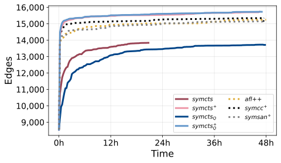 | 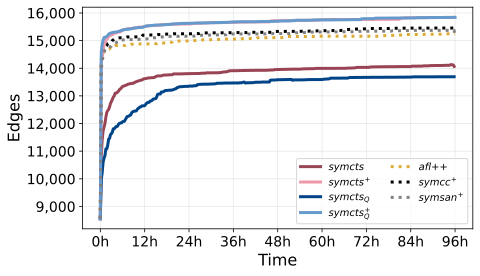

| fuzzer             | last_reported_time | count  | min     | max     | mean            | median       |
| ------------------ | ------------------ | ------ | -----   | -----   | -------------   | ----------   |
| symcts_symqemu_afl | 96h0m              | 8      | 15839🥇 | 15848🥇 | 15843.500000🥇  | 15843.5🥇    |
| symcts_afl         | 95h45m             | 12     | 15762🥈 | 15845🥈 | 15816.333333🥈  | 15842.0🥈    |
| symcc_aflplusplus  | 96h0m              | 4      | 15445🥉 | 15445🥉 | 15445.000000🥉  | 15445.0🥉    |
| aflplusplus        | 96h0m              | 20     | 15203   | 15416   | 15273.800000    | 15251.0      |
| symsan             | 96h0m              | 8      | 14928   | 15370   | 15149.000000    | 15149.0      |
| symcts             | 95h45m             | 4      | 14066   | 14066   | 14066.000000    | 14066.0      |
| symcts_symqemu     | 95h45m             | 12     | 13684   | 13779   | 13718.666667    | 13693.0      |


The worst instances of symcts_afl and symcts_symqemu_afl beat all instances of any of the other tools.

Of note:
As seen in this plot (plotting from 8h on in), after only ~12 hours symcts_afl and symcts_symqemu_afl both surpass the coverage other fuzzers reach in 96 hours.


|             2d            |             4d           |
| ------------------------- | ------------------------ |
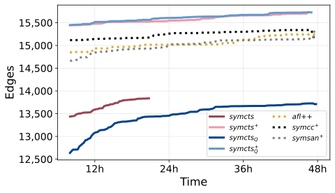 | 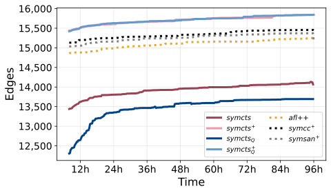

## libxslt_xpath

### 4d
| fuzzer             | last_reported_time | count  | min     | max     | mean            | median       |
| ------------------ | ------------------ | ------ | -----   | -----   | -------------   | ----------   |
| symcts_afl         | 95h45m             | 20     | 11314🥈 | 11444🥇 | 11363.8🥇       | 11333.0🥇    |
| symcts_symqemu_afl | 95h45m             | 20     | 11322🥇 | 11377🥈 | 11339.8🥈       | 11330.0🥈    |
| symcc_aflplusplus  | 95h45m             | 20     | 11181🥉 | 11356🥉 | 11270.6🥉       | 11298.0🥉    |
| symsan             | 96h0m              | 20     | 11154   | 11283   | 11232.4         | 11259.0      |
| aflplusplus        | 96h0m              | 20     | 11174   | 11288   | 11239.0         | 11249.0      |
| symcts_symqemu     | 95h45m             | 4      | 8640    | 8640    | 8640.0          | 8640.0       |
| symcts             | 95h15m             | 16     | 8565    | 8709    | 8636.0          | 8635.0       |

### 2d
| fuzzer             | last_reported_time | count  | min     | max     | mean            | median       |
| ------------------ | ------------------ | ------ | -----   | -----   | -------------   | ----------   |
| symcts_afl         | 45h30m             | 12     | 11269🥇 | 11302🥇 | 11284.0🥇       | 11282.5🥇    |
| symcts_symqemu_afl | 46h0m              | 3      | 11248🥈 | 11248   | 11248.0🥈       | 11248.0🥈    |
| symsan             | 47h0m              | 6      | 11119   | 11285🥉 | 11202.0         | 11202.0🥉    |
| symcc_aflplusplus  | 46h15m             | 12     | 11122🥉 | 11301🥈 | 11206.5🥉       | 11201.5      |
| aflplusplus        | 47h0m              | 9      | 11037   | 11231   | 11140.0         | 11152.0      |
| symcts_symqemu     | 47h15m             | 3      | 8516    | 8516    | 8516.0          | 8516.0       |
| symcts             | 46h15m             | 3      | 8462    | 8462    | 8462.0          | 8462.0       |


Plots aren't very informative due to thelarge difference and small coverage for symcts and symcts_symqemu.

Of note, again symcts_afl and symcts_symqemu_afl's worst instances outperform all best instances of all other approaches with the exception of SymCC.
As apparent from the median, at most 2 instances of SymCC were able to compete with the worst symcts instances.
Moreso, the best symcts instance outperforms the best SymCC instance by more edges than the best SymCC edges outperformed fuzzing.


## openh264_decoder_fuzzer
| fuzzer             | last_reported_time | count  | min     | max     | mean            | median       |
| ------------------ | ------------------ | ------ | -----   | -----   | -------------   | ----------   |
| symcts_afl         | 96h0m              | 5      | 9560🥇  | 9573🥇  | 9566.4🥇        | 9566.0🥇     |
| symcts_symqemu_afl | 96h0m              | 5      | 9545🥈  | 9571🥈  | 9558.6🥈        | 9562.0🥈     |
| aflplusplus        | 96h0m              | 5      | 9375🥉  | 9571🥈  | 9500.4🥉        | 9520.0🥉     |
| symcc_aflplusplus  | 96h0m              | 5      | 9318    | 9539🥉  | 9431.4          | 9405.0       |
| symcts             | 7h0m               | 4      | 8570    | 8570    | 8570.0          | 8570.0       |
| symcts_symqemu     | 42h15m             | 4      | 8545    | 8545    | 8545.0          | 8545.0       |


|             2d            |             4d           |
| ------------------------- | ------------------------ |
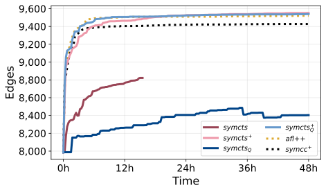 | 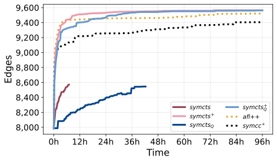

While the best instances of AFL++ were able to reach mostly the same coverage as the symcts instances,
you can see from the plot that they did so only near the end of the 4 days, and symcts has a non-insignificant lead for most of the eval.

```
Might warrant having a different plot showing the min and maximum here.
If AFL++'s max is also reached roughly around the same time as ours, we can still argue for the consistency of our
approach, but it weakens the point (counter point would be: okay, so just run more fuzzers).
```

# Interesting examples
## openthread

### 4 days
| fuzzer             | last_reported_time | count  | min     | max     | mean            | median       |
| ------------------ | ------------------ | ------ | -----   | -----   | -------------   | ----------   |
| symcts_afl         | 96h0m              | 20     | 3601🥉  | 4525🥈  | 4078.00🥇       | 4194.0🥇     |
| symcts             | 96h0m              | 16     | 3716🥇  | 4265🥉  | 3889.00🥈       | 3787.5🥈     |
| symcc_aflplusplus  | 96h0m              | 20     | 3594    | 4607🥇  | 3845.40🥉       | 3690.0🥉     |
| symcts_symqemu_afl | 96h0m              | 20     | 3603🥈  | 3636    | 3620.60         | 3627.0       |
| symsan             | 96h0m              | 20     | 3064    | 3623    | 3499.00         | 3606.0       |
| symcts_symqemu     | 96h0m              | 16     | 3507    | 3557    | 3539.25         | 3546.5       |
| aflplusplus        | 96h0m              | 20     | 3058    | 3601    | 3374.20         | 3541.0       |
### 2 days
| fuzzer             | last_reported_time | count  | min     | max     | mean            | median       |
| ------------------ | ------------------ | ------ | -----   | -----   | -------------   | ----------   |
| symcts             | 48h0m              | 15     | 3530    | 3851🥈  | 3693.4🥉        | 3747.0🥇     |
| symcts_afl         | 48h0m              | 15     | 3590🥈  | 4628🥇  | 4011.0🥇        | 3729.0🥈     |
| symcc_aflplusplus  | 48h0m              | 15     | 3581🥉  | 3841🥉  | 3705.0🥈        | 3673.0🥉     |
| symcts_symqemu_afl | 48h0m              | 15     | 3593🥇  | 3618    | 3607.0          | 3610.0       |
| symsan             | 48h0m              | 15     | 3045    | 3614    | 3478.4          | 3574.0       |
| symcts_symqemu     | 48h0m              | 15     | 3504    | 3560    | 3521.6          | 3514.0       |
| aflplusplus        | 48h0m              | 15     | 3056    | 3797    | 3363.6          | 3432.0       |


|             2d            |             4d           |
| ------------------------- | ------------------------ |
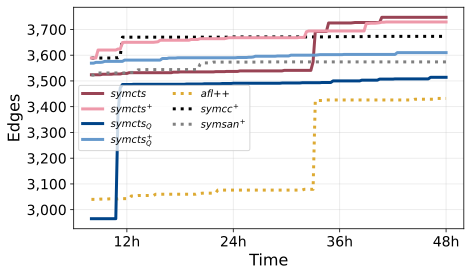 | 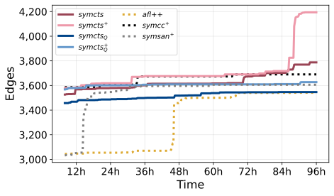


Plot from 8 hours on to make the differences more visible.
Weird case. Both good and bad example.
Symcc 's best is a bit better than our best.
On the other hand, that appears to be a single instance, all the other ones are performing much worse.
Our median (which is plotted) is up ~16% edges by the end of symcc's median.
SymCC's best is up 1.8% over our best.

NOTE:
```
In general concolic execution approaches seem to exhibit a VERY high variance for this target.
Maybe there's areas of code that they can get stuck in where it takes them a while to escape.
Hard constraints, lots of paths?

My intuition is that there's a bunch of coverage left to explore that needs more time to run to account for that.
```

On the other hand symcts alone is massively outperforming all other non-symcts approaches which is cool.
Its worst instance beats everything except for that runaway SymCC instance (at worst it beats all but 2 of symcc's instance, not discernible from just mean/median ATM).

## sqlite3

### 4 days
| fuzzer             | last_reported_time | count  | min     | max     | mean            | median       |
| ------------------ | ------------------ | ------ | -----   | -----   | -------------   | ----------   |
| symcts_afl         | 91h30m             | 8      | 20521🥇 | 20590🥇 | 20555.5🥇       | 20555.5🥇    |
| symcts_symqemu_afl | 91h30m             | 8      | 20381🥈 | 20401🥈 | 20391.0🥈       | 20391.0🥈    |
| aflplusplus        | 93h15m             | 4      | 19659🥉 | 19659🥉 | 19659.0🥉       | 19659.0🥉    |
| symsan             | 92h45m             | 4      | 17059   | 17059   | 17059.0         | 17059.0      |
| symcts_symqemu     | 94h15m             | 4      | 9697    | 9697    | 9697.0          | 9697.0       |
| symcts             | 94h45m             | 4      | 9467    | 9467    | 9467.0          | 9467.0       |
### 2 days
| fuzzer             | last_reported_time | count  | min     | max     | mean            | median       |
| ------------------ | ------------------ | ------ | -----   | -----   | -------------   | ----------   |
| symcts_afl         | 47h0m              | 3      | 19968🥇 | 19968🥇 | 19968.000000🥇  | 19968.0🥇    |
| symcts_symqemu_afl | 47h0m              | 3      | 19388🥈 | 19388🥈 | 19388.000000🥈  | 19388.0🥈    |
| aflplusplus        | 47h15m             | 12     | 15743🥉 | 19256🥉 | 17567.500000🥉  | 17635.5🥉    |
| symsan             | 47h15m             | 9      | 14538   | 18195   | 16574.666667    | 16991.0      |
| symcts_symqemu     | 48h0m              | 9      | 9514    | 9544    | 9524.666667     | 9516.0       |
| symcts             | 48h0m              | 6      | 9140    | 9352    | 9246.000000     | 9246.0       |


|             2d            |             4d           |
| ------------------------- | ------------------------ |
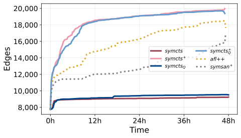 | 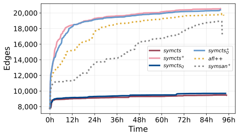
Great target for us, our worst instances beat everything else by a decent margin, amazing early advantage, eventually others catch up a bit more.
Unfortunately small sample size, only 1/2 instances were reporting results by the end.
You can see symsan instances dropping out at the end.
Same for 2 days, our lowest instance beats everything else.

# Interesting negative examples

## libpcap
All concolic execution approaches do nothing because input gets written to file and read back out before being processed.
This is a "feature" of the harness and a severely dumb oversight on the side of concolic approaches.

## openssl_x509

Might be useful to have as a negative example for symcts? As in, let's investigate why symsan does better than us.
Better modeling in their cov impl? Faster? Let's see.
String handling? Length variation? Not sure.
Based on the earlier parts of the plot it could also just be unluck, compare from the 2d run to see.


|             2d            |             4d           |
| ------------------------- | ------------------------ |
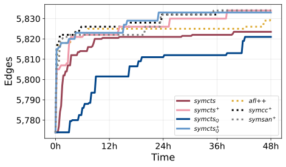 | 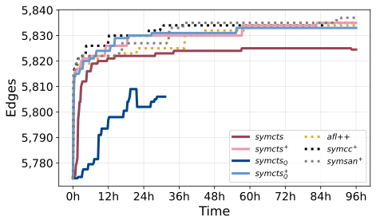


# Interesting takeaways & Findings

Over all symcc + AFL vs. symqemu + AFL for most targets don't seem to have large discrepancies in terms of effectiveness.
That was a bit surprising.

For some targets concolic straight up beats regular and hybrid fuzzing approaches, while for some it's far behind.
This to me indicates that there's some common blockers/shortcomings that prevent concolic execution from exhibiting its true potential.
Investigation is needed into what these fundamental blockers are and if they're lazy engineering (missing handling) or
fundamental shortcomings of concolic (indirect taint/over-constraining, etc.)
Also interesting for this are targets where symcc vs. symqemu alone have drastically different results (e.g. bloaty).
This indicates clear issues in the source instrumentation since symqemu does really well.
Similarly, if symcc beats symqemu by a lot, that indicates to me problems where the low-level nature of binary instrumentation
causes issues which is an interesting case study of its own.
Maybe these ARE the cases where the constraints are harder, or maybe they're a coverage metric mismatch (since we're still using source-code-based coverage collection). That would hammer home the point of the REQUIREMENT of matching the coverage metric to
the mutation/instrumentation approach you use. Such mismatches generally lead to bad results.