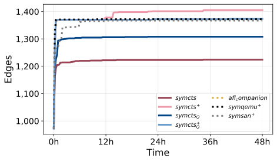
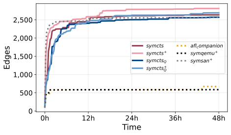
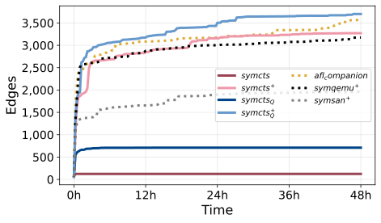
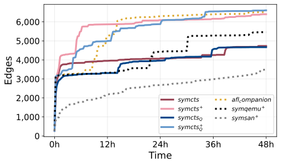

# Legend

$${\color{green}{\text{Highest SyMCTS entry}}}$$
$${\color{orange}{\text{Highest Non-SyMCTS Entry}}}$$

🥇🥈🥉 - 1st, 2nd and 3rd best in column

# Positive examples

## sqlite3

| fuzzer             | last_reported_time | count  | min   | max   | mean          | median     |
| ------------------ | ------------------ | ------ | ----- | ----- | ------------- | ---------- |
| symcts_afl         | 48h0m              | 3      | 1400  | 5023  | 2609.333333   | 1405.0     |
| symcts_symqemu_afl | 48h0m              | 3      | 1370  | 1399  | 1380.666667   | 1373.0     |
| afl_companion      | 48h0m              | 3      | 1346  | 1397  | 1371.666667   | 1372.0     |
| symqemu_afl        | 48h0m              | 3      | 1372  | 1376  | 1373.333333   | 1372.0     |
| symsan             | 48h0m              | 3      | 1366  | 1370  | 1367.666667   | 1367.0     |
| symcts_symqemu     | 48h0m              | 3      | 1307  | 1317  | 1310.666667   | 1308.0     |
| symcts             | 48h0m              | 3      | 1224  | 1227  | 1225.000000   | 1224.0     |

Win for hybrid symcts_afl (clearly) and very slight win (probably not significant) for symcts_symqemu_afl.
All instances of symcts_afl beat all other instances of all other approaches.
Especially of note is the signficantly higher coverage of the best symcts_afl instance beating all other instances by 3.6x.
On the other hand, the worst instance of symcts_afl also still beats all other instances.

TODO: Investigate what we reached that others didn't.

## libsndfile

No AFL & no symqemu AFL because it's too bad.

_(no_symqemu_afl).svg)

### 8 hour plot (no AFL or symqemu as they are too bad)

symcts_afl beats symsan (and all non-symcts approaches) by 9.1% (the best instance beats the best symsan instance by 16.4%).
symcts alone beats symsan.
symcts_symqemu alone is on par with symsan.
symcts_symqemu_afl beats symsan (roughly on par, but slightly better than symcts alone).

| fuzzer             | last_reported_time | count  | min   | max   | mean          | median     |
| ------------------ | ------------------ | ------ | ----- | ----- | ------------- | ---------- |
| symcts_afl         | 48h0m              | 3      | 2797  | 3004  | 2870.666667   | 2811.0     |
| symcts_symqemu_afl | 48h0m              | 3      | 2664  | 2692  | 2682.333333   | 2691.0     |
| symcts             | 48h0m              | 3      | 2562  | 2689  | 2629.000000   | 2636.0     |
| symsan             | 48h0m              | 3      | 2423  | 2580  | 2526.333333   | 2576.0     |
| symcts_symqemu     | 48h0m              | 3      | 2566  | 2583  | 2573.333333   | 2571.0     |
| afl_companion      | 48h0m              | 3      | 587   | 677   | 645.666667    | 673.0      |
| symqemu_afl        | 48h0m              | 3      | 585   | 677   | 616.333333    | 587.0      |

## libpng

.svg)

| fuzzer             | last_reported_time | count  | min   | max   | mean          | median     |
| ------------------ | ------------------ | ------ | ----- | ----- | ------------- | ---------- |
| symcts_afl         | 48h0m              | 3      | 1616  | 1719  | 1683.666667   | 1716.0     |
| symcts_symqemu_afl | 48h0m              | 3      | 1691  | 1731  | 1712.333333   | 1715.0     |
| symsan             | 48h0m              | 3      | 1648  | 1658  | 1654.000000   | 1656.0     |
| symcts             | 48h0m              | 3      | 1413  | 1564  | 1508.000000   | 1547.0     |
| symcts_symqemu     | 48h0m              | 3      | 1433  | 1517  | 1473.666667   | 1471.0     |
| symqemu_afl        | 48h0m              | 3      | 1416  | 1670  | 1507.000000   | 1435.0     |
| afl_companion      | 48h0m              | 3      | 54    | 54    | 54.000000     | 54.0       |

- symcts and symcts_symqemu alone beat symqemu_afl.
- symcts_afl and symcts_symqemu_afl beat symsan.
- symcts_symqemu_afl actually best in min and max, but not in median interestingly, doesn't beat symcts_afl often.

# Interesting negative examples

## libtiff & libxml2

We seem to not be doing significantly better than afl or symqemu_afl. It seems like all approaches are mostly just afl?

## openssl_x509

Might be useful to have as a negative example for symcts? As in, let's investigate why symsan does better than us.
Better modeling in their cov impl? Faster? Let's see.
String handling? Length variation? Not sure.
Based on the earlier parts of the plot it could also just be unluck, compare from the 2d run to see.

|             2d            |             4d           |
| ------------------------- | ------------------------ |
 | 

# Interesting takeaways & Findings

Over all symcc + AFL vs. symqemu + AFL for most targets don't seem to have large discrepancies in terms of effectiveness.
That was a bit surprising.

For some targets concolic straight up beats regular and hybrid fuzzing approaches, while for some it's far behind.
This to me indicates that there's some common blockers/shortcomings that prevent concolic execution from exhibiting its true potential.
Investigation is needed into what these fundamental blockers are and if they're lazy engineering (missing handling) or
fundamental shortcomings of concolic (indirect taint/over-constraining, etc.)
Also interesting for this are targets where symcc vs. symqemu alone have drastically different results (e.g. bloaty).
This indicates clear issues in the source instrumentation since symqemu does really well.
Similarly, if symcc beats symqemu by a lot, that indicates to me problems where the low-level nature of binary instrumentation
causes issues which is an interesting case study of its own.
Maybe these ARE the cases where the constraints are harder, or maybe they're a coverage metric mismatch (since we're still using source-code-based coverage collection). That would hammer home the point of the REQUIREMENT of matching the coverage metric to
the mutation/instrumentation approach you use. Such mismatches generally lead to bad results.